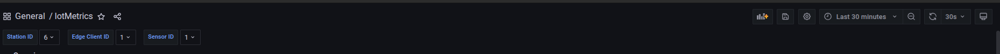
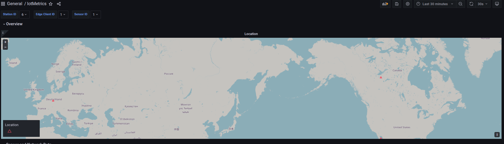
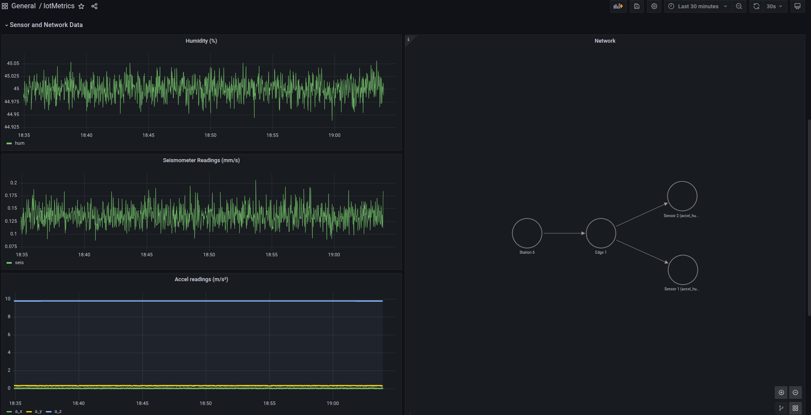
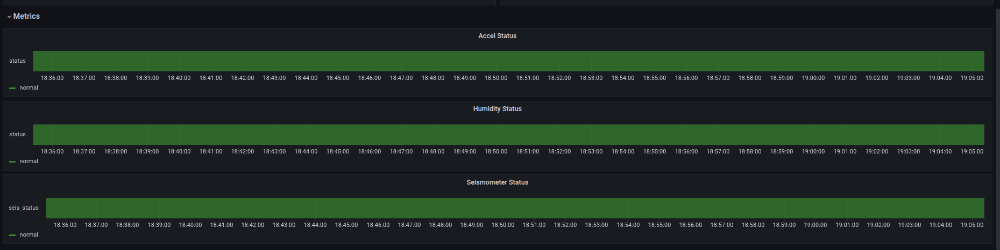

# Directory Structure (`meta-nanometrics/recipes-custom`)

This directory contains custom Yocto recipes and source modules for the system build[cite: 1, 2, 3]. For detailed build instructions, configuration options, and module-specific setups, refer to the individual `README.md` files located inside each subfolder.

---

### Folder Overview

* **`backend-server`**: Recipe and source code for the backend service responsible for aggregating incoming telemetry and forwarding data to external APIs.
* **`edge-client`**: Client application intended to run on edge devices, collecting sensor data and communicating upstream with the station service.
* **`hello-nanometrics`**: Basic test or reference recipe used for workspace verification, system sanity checks, and initial layer setup.
* **`rust_tools`**: Shared Rust utilities and core tooling modules—such as logging infrastructure—utilized across multiple workspace components.
* **`sensor-client`**: Driver or client implementation dedicated to interfacing directly with localized physical sensor hardware.
* **`station-client`**: Station-level service that runs a TCP server to accept incoming connections from edge nodes, process payloads, and manage shared buffers.
* **`test`**: Automated test suites, integration tests, and debugging scripts used to validate component functionality across the workspace.
* **`todo.txt`**: Task tracking and upcoming feature backlog for layer maintainers.

---

## Visualization Demo

### 1. Filter

### 2. Map

### 3. Insights

### 4. Metrics

> **Note:** Each directory contains its own `README.md` with deep-dive technical documentation, environment setup, and compilation details. Please inspect the target module's directory prior to building.

> **Note:** Only sensor-client and edge-client have Yocto recipes since they are intended to be run on target boards. Non Yocto repositories should be moved elsewhere --todo later.